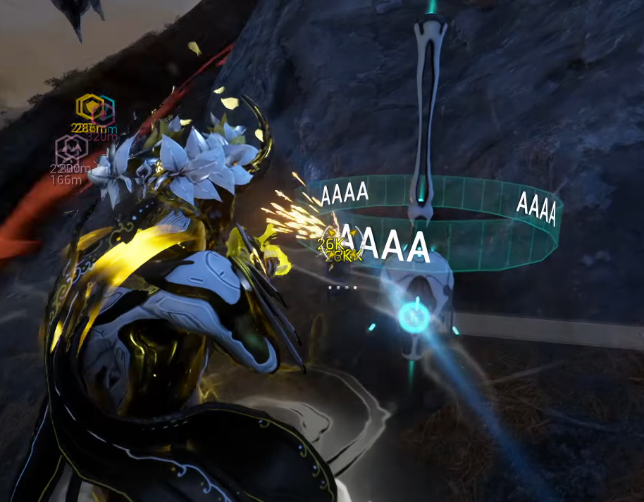

# Advanced Knowledge

## Lure Routes

### 1. Hek's Stiletto Route

Get the double Lures last because it guarantee 5 lures, if you don't sometime the double lures won't spawn.

    <iframe 
        src="https://www.youtube.com/embed/YpsTGlDkqcM?si=sPJntNNaICJGBSaq" 
        allow="accelerometer; autoplay; clipboard-write; encrypted-media; gyroscope; picture-in-picture; web-share" 
        frameborder="0"
        allowfullscreen>
    </iframe>

### 2. The Seethe Route

Same, get the double Lures last.

    <iframe 
        src="https://www.youtube.com/embed/JVb1xIqQWVA?si=pLpq_mDv55sLWKtz" 
        allow="accelerometer; autoplay; clipboard-write; encrypted-media; gyroscope; picture-in-picture; web-share" 
        frameborder="0"
        allowfullscreen>
    </iframe>

## Gantulyst/Hydrolyst Spawn Spots and how to deal with them

There are a total of 4 spots called Close Left, Close Right, Mid, Long.

### Close Right

CR is easy, shoot limbs in whatever order you like, preferably lefr - right - left - right.

    <iframe 
        src="https://www.youtube.com/embed/UfiuCOKniHU?si=XkXxpxyR9onD1ZTl" 
        allow="accelerometer; autoplay; clipboard-write; encrypted-media; gyroscope; picture-in-picture; web-share" 
        frameborder="0"
        allowfullscreen>
    </iframe>

### Close Left

Limbs Order: R-L-R-L-R-L. Hit the knees first.

The trick to hit right arm is save your Void Strike, don't use it right away.

After Propa, fall back so you can aim at it.

    <iframe 
        src="https://www.youtube.com/embed/O3RWNpWBLZI?si=Acu2IQajZCaeZ6jh" 
        allow="accelerometer; autoplay; clipboard-write; encrypted-media; gyroscope; picture-in-picture; web-share" 
        frameborder="0"
        allowfullscreen>
    </iframe>

### Mid

Limbs Order: R-R-R-L-L-L. Place shields like in the video

Save your Void Strike for the last limb.

    <iframe 
        src="https://www.youtube.com/embed/VH74PBLRsGA?si=97NKlqn-5eS1XT77" 
        allow="accelerometer; autoplay; clipboard-write; encrypted-media; gyroscope; picture-in-picture; web-share" 
        frameborder="0"
        allowfullscreen>
    </iframe>

### Long

Limbs Order: R-R-L-R-L-L.

2nd Void Strike is casted ealier, at 2nd wave of eidolon's scream.

So that VS cooldown at the last limb.

    <iframe 
        src="https://www.youtube.com/embed/Vk7cmou2mCY?si=2puxBs4PpPX_1Anx" 
        allow="accelerometer; autoplay; clipboard-write; encrypted-media; gyroscope; picture-in-picture; web-share" 
        frameborder="0"
        allowfullscreen>
    </iframe>

This one is tricky.

This is the reason why you bring Zenith and not Rubico or something else. 

Because Zenith has infinite punchthrough, it can shoot eidolon when it's underground.

I have a blue pin placed at where the limb's supposed to be, but some people don't need it.

I can make a video show you how to bug underground, but someone with the already placed pin have to guide you face to face.

    

