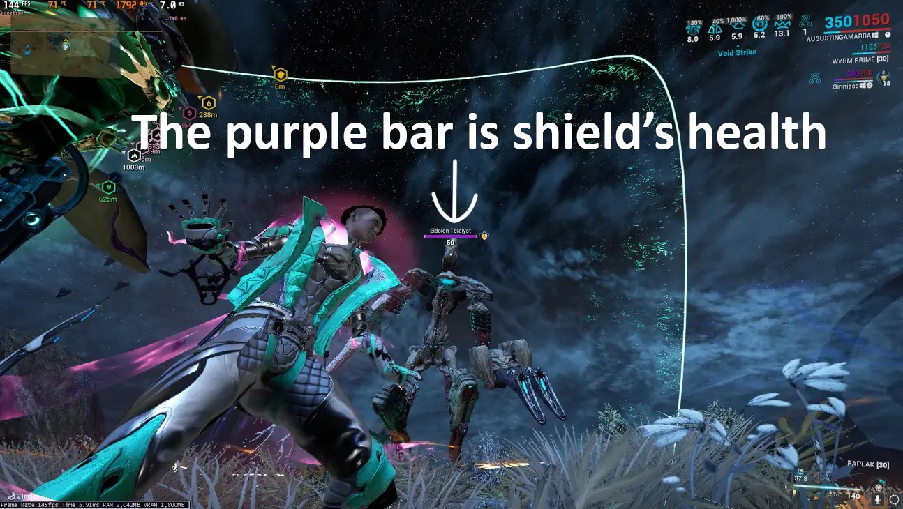
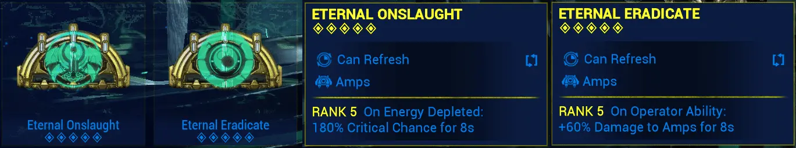
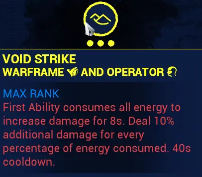
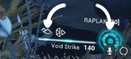
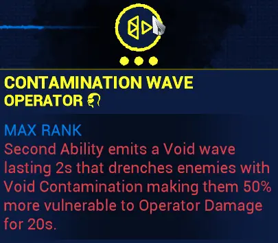
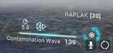
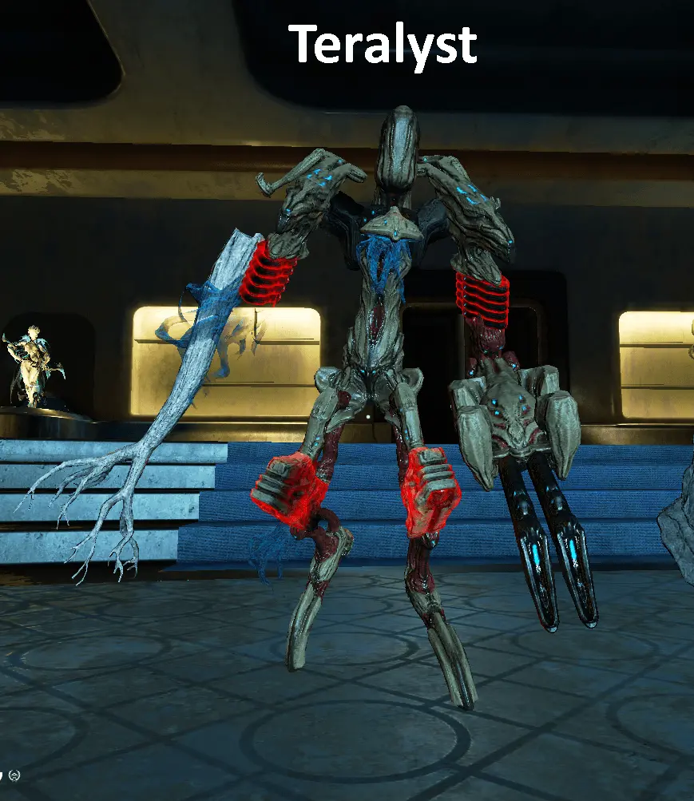
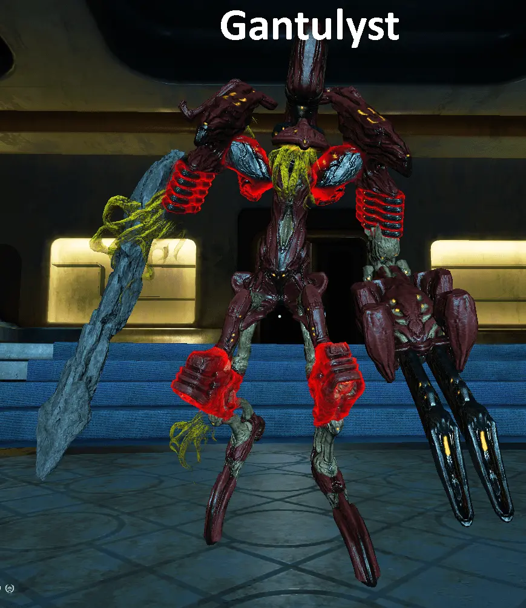
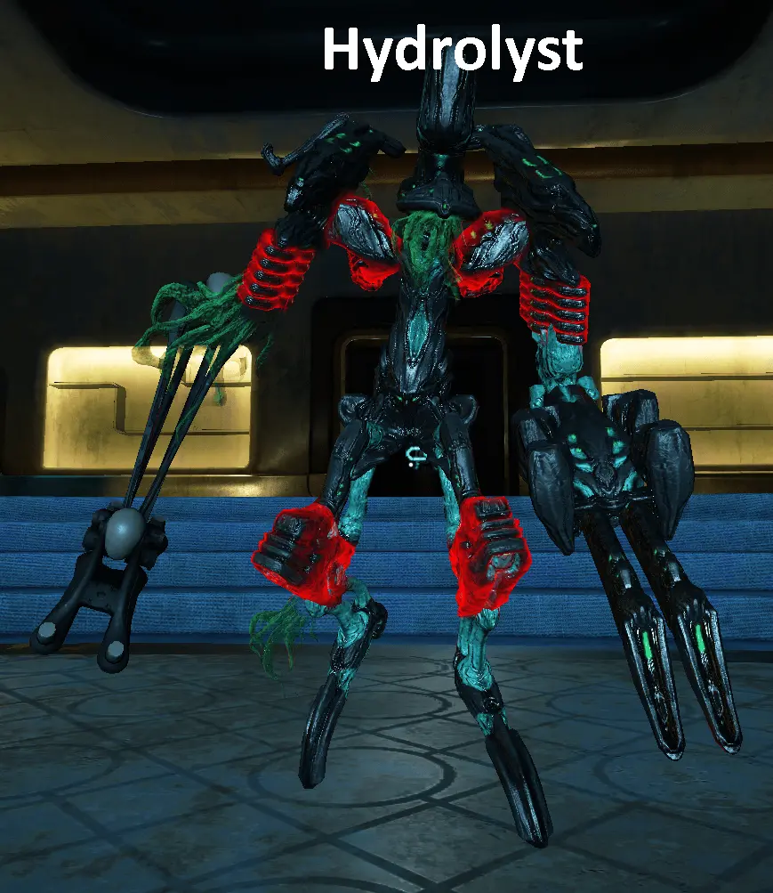

# Basic knowledge

1. Eidolon Shields are immune to all kinds of damage except Void Damage.
2. Operator Amp deals Void Damage. So to take down Eidolon Shield you use Operator Amp.

<!-- panels:start -->

## How to take down a shield?

### What is a shield?

#### There are 2 ways to take down a shield

<!-- div:title-panel -->

#### 1. Void Strike

<!-- div:left-panel -->

- Activating Void Strike with a 100% bar of Energy gives you 10% x 100% = 1000% damage increase
- This also activate Eternal Onslaught and Eternal Eradicate.

<!-- div:right-panel -->

  

  
  
  

<!-- div:left-panel -->

- Do the math and you'll have
  - Crit Chance:
    - Raplak = 104.4%
    - Propa = 90%
  - Damage: a shit ton
- Since raplak will guarantee crit, everytime you activate Void Strike just use Raplak

<!-- div:right-panel -->

<!-- div:title-panel -->

#### 2. Depleting Energy

<!-- div:left-panel -->

- You used Void Strike, can't use it again since cool down time is 40s. Now what do you do?
- Use your 2nd Ability - Contamination Wave

<!-- div:right-panel -->

  

  
  
  

<!-- div:left-panel -->

- Activate CW 3 times and a Void Sling if you have a full bar of Energy.

<!-- div:right-panel -->

  

  
  

<!-- div:left-panel -->

- Then Propa - Propa - Raplak to destroy the shield.

-     Propa - Propa - Raplak = Middle Mouse - Middle Mouse - Left Click

- In my case i remapped "Middle Mouse" to "Mouse Wheel Up" so it'd be:

-     Wheel Up - Wheel Up - Left Click

- Then press E to Melee (Vastilok) to destroy the limb

-     Pressing 5 to transfer from Operator to Warframe is significantly slower than pressing E

<!-- div:title-panel -->

## How to take down a limb?

### What is a limb

Parts that are highlighted red are limbs

### Use Vastilok

- Vastilok is a Gunblade, that means it's a shotgun disguise as a Melee

### Use Zenith

- Zenith is a primary weapon, if your Vastilok couldn't finish the limb, just click Left Mouse to fire Zenith
- Zenith have 2 fire mode, Auto and Semi-Auto. You'll want the Semi-Auto Mode since it deals higher damage
- To Switch to Semi-Auto, click Middle Mouse.

## Teralyst

## Gantulyst

## Hydrolyst

<!-- panels:end -->