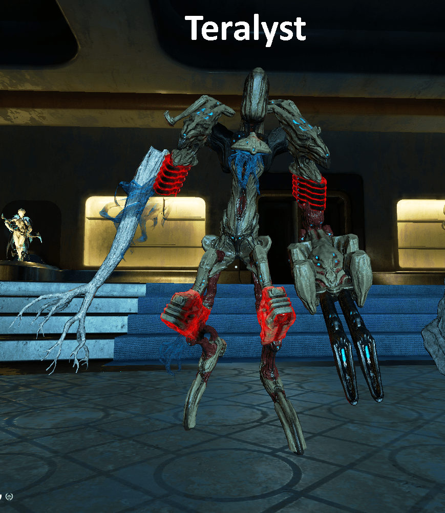
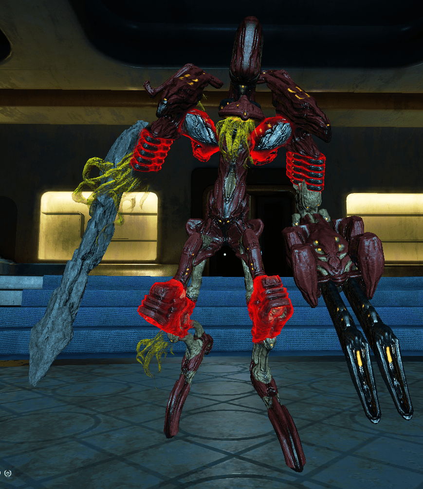
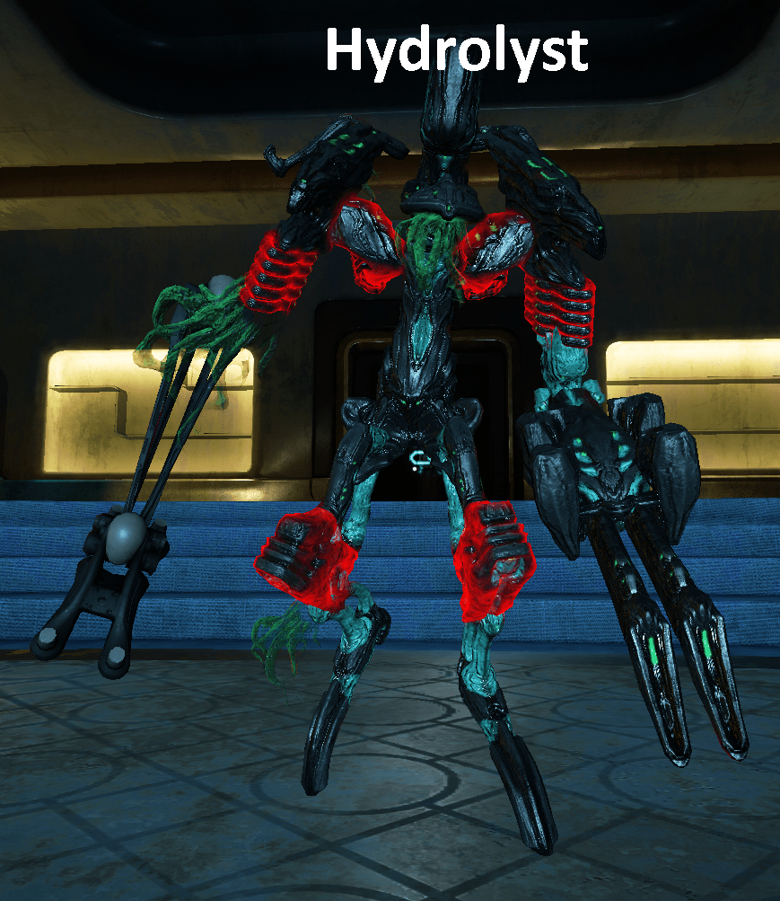

## Getting Started
1. Eidolon Shields are immune to all kinds of damage except Void Damage.
2. Operator Amp deals Void Damage. So to take down Eidolon Shield you use Operator Amp.

## Teralyst

## Gantulyst

## Hydrolyst

