## Total Gear

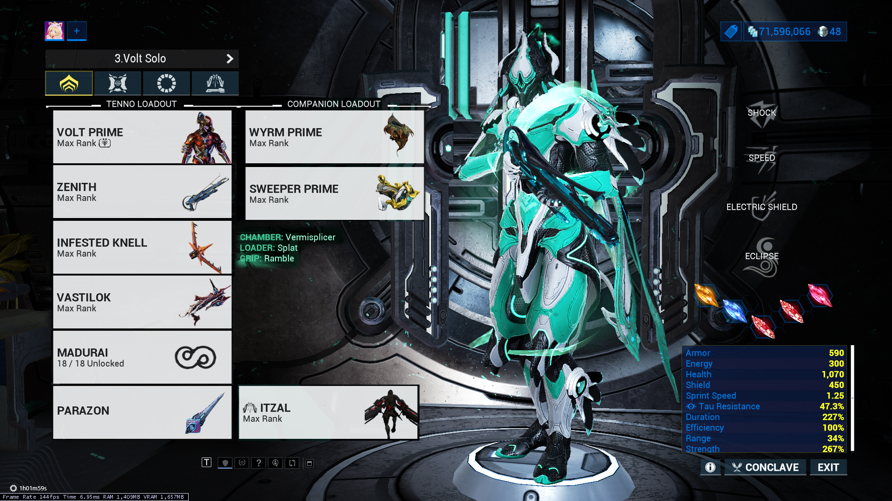

## Warframe

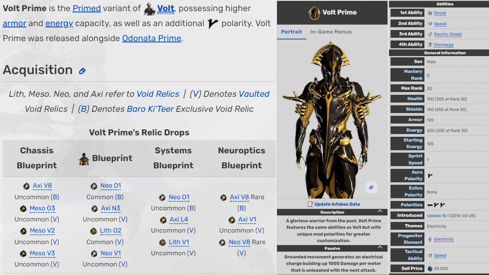
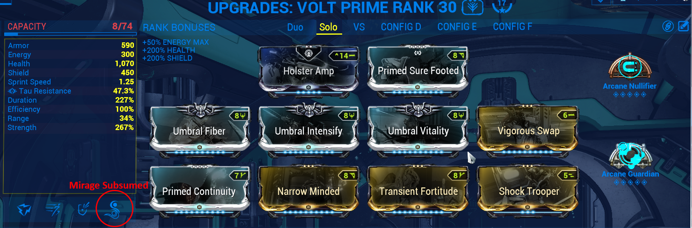

## Zenith

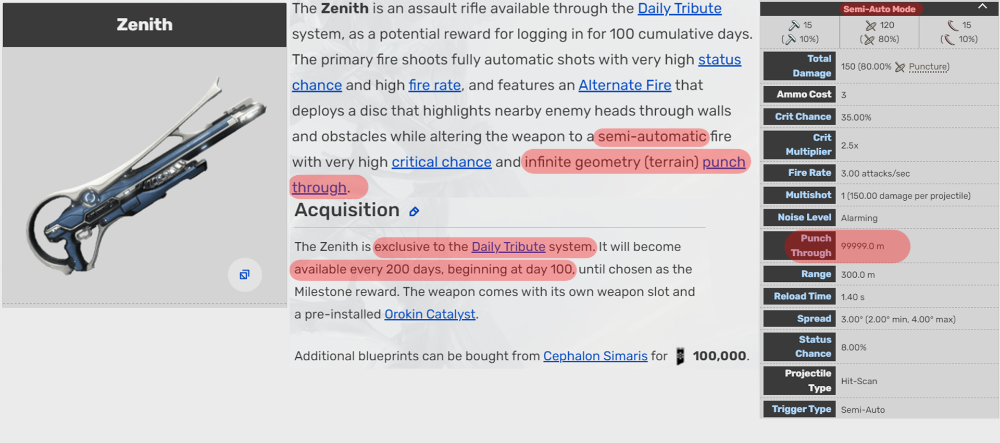
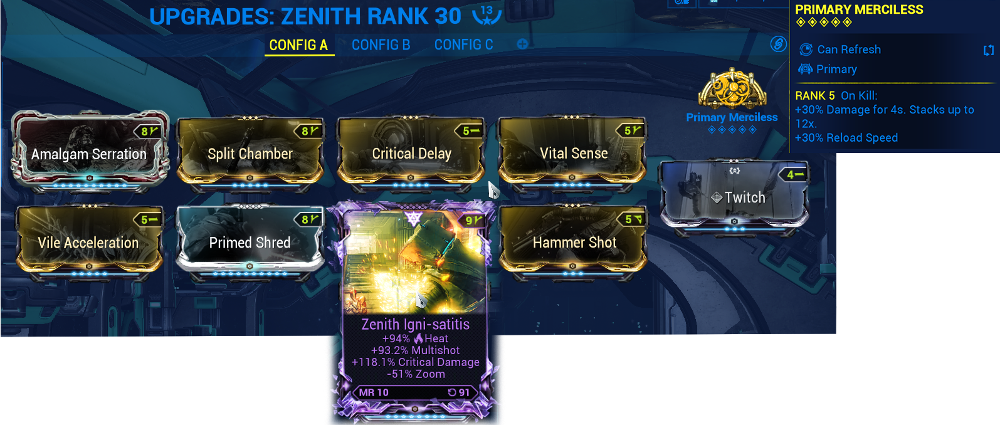

## Vermisplicer

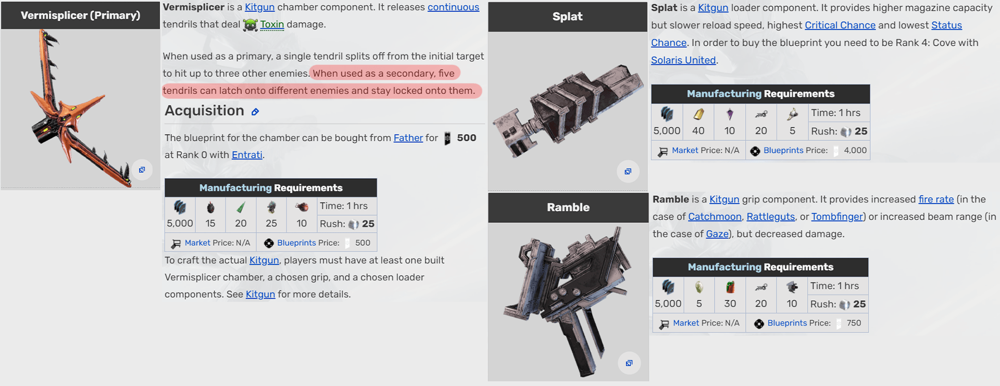
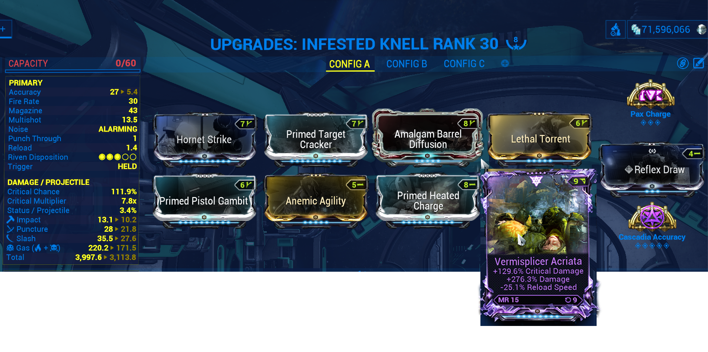

## Vastilok
High noon for maximum amounts of pellets since Shattering Impact strips 6 armor per pellet

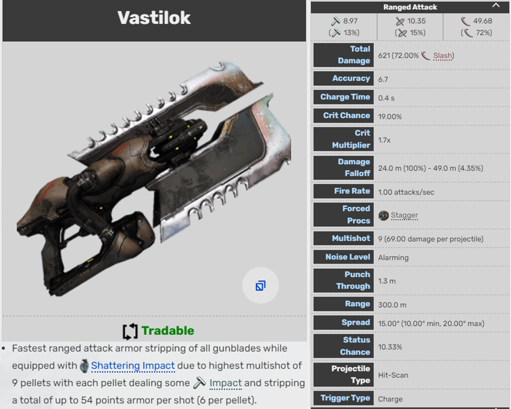
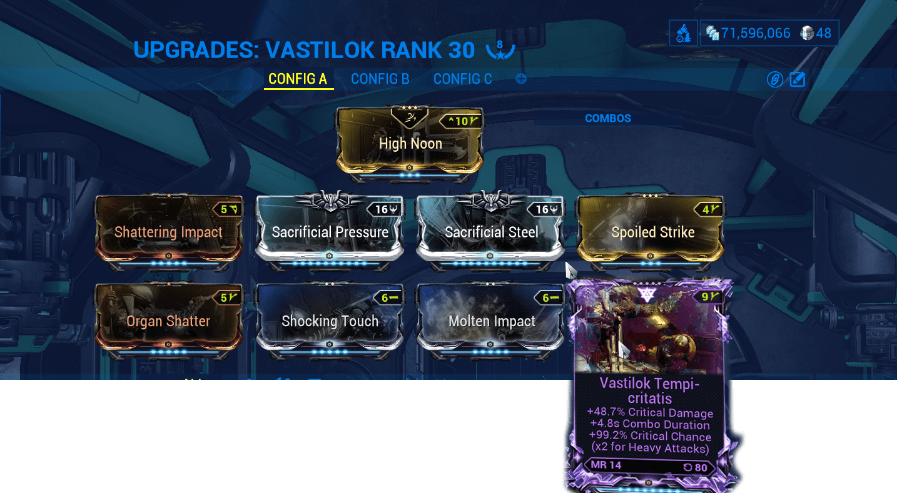

## Madurai

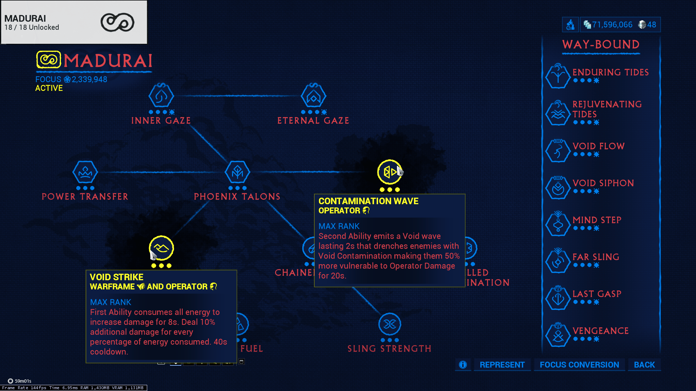

## Parazon
Untraceble for invisible after hacking

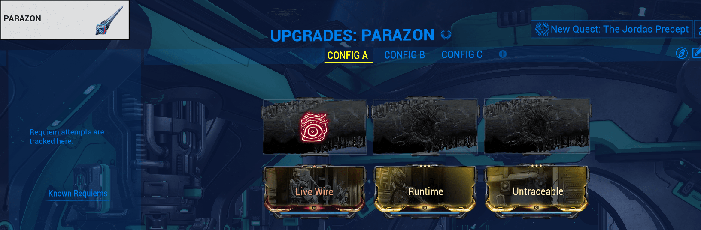

## Itzal

Cold Snap to freeze vomvalysts

Hyperion Thrusters for fly speed

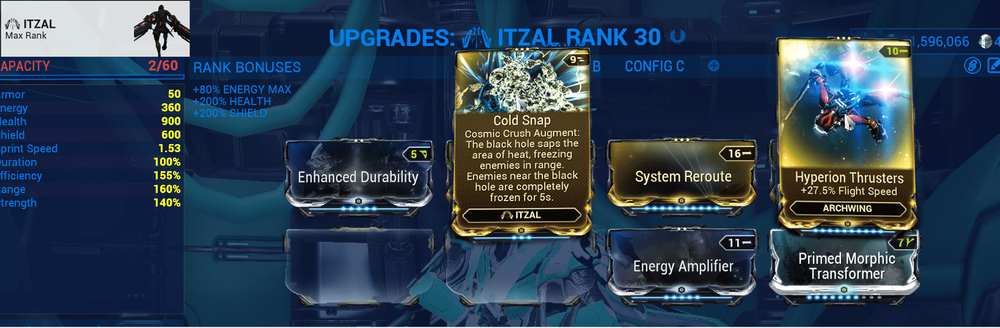

## Wyrm Prime
### Negate

## Sweeper Prime
Set Stat: "15% chance to enhance Critical Hits"

## Gearwheel
Gear Wheel have:
1. Necramech - Bind to 6
2. On Call Crew - Bind to 9
3. Archwing Launcher - Bind to Mouse Wheel Down
4. Squad Energy Restore - Bind to Ctrl

## Intrinsic
Command must be at least Rank 9 to use On Call

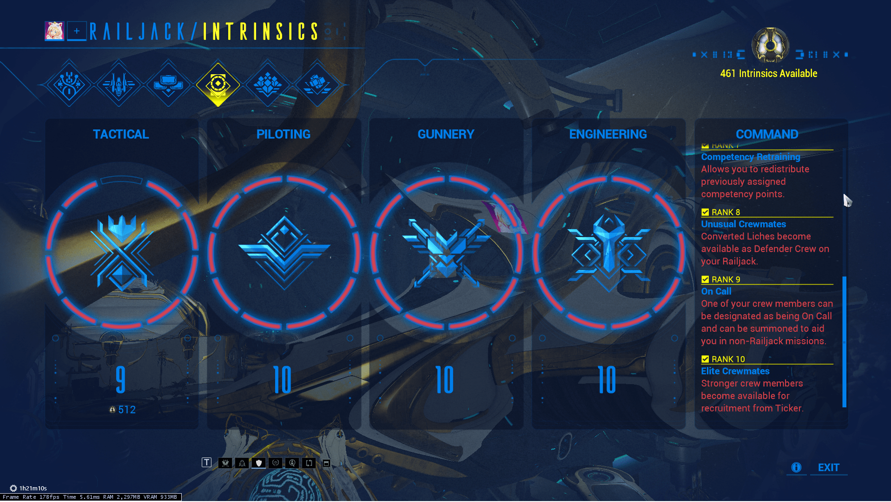

## Crew
Crewmate equip Kuva Nukor

# Now Let's Hunt 
[Hunt](hunt.md)
